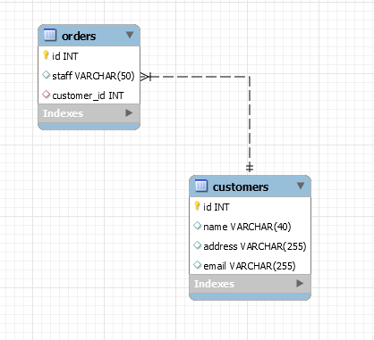
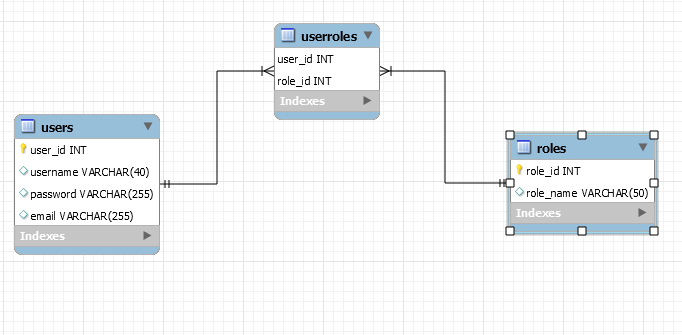
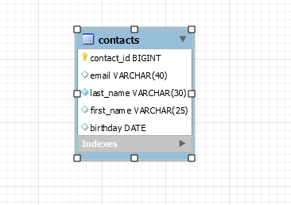
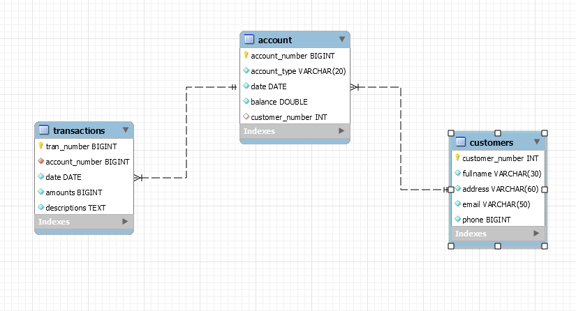
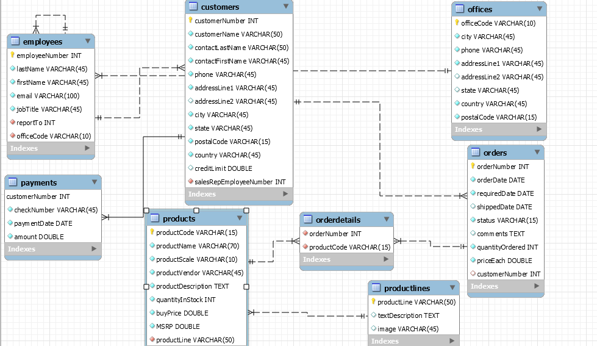
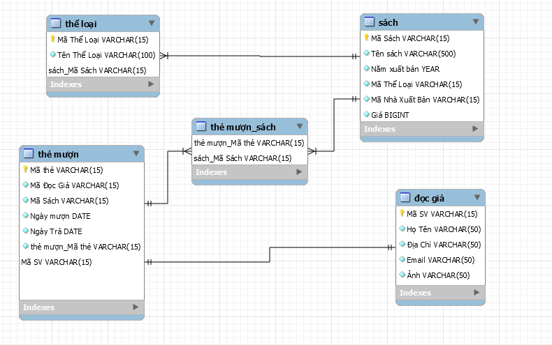

# TH - Tao Khoa Ngoai

# TH- Tao Khoa Chinh

# TH-Thao Tac Voi Bang

# BT- Xac Dinh Khoa Chinh Khoa Ngoai

# BT- Phan Tich va Thiet Ke CSDL

# BT-Thiet Ke Va Cai Dat CSDL Cho Ung Dung Quan Ly Thu Vien-P1
